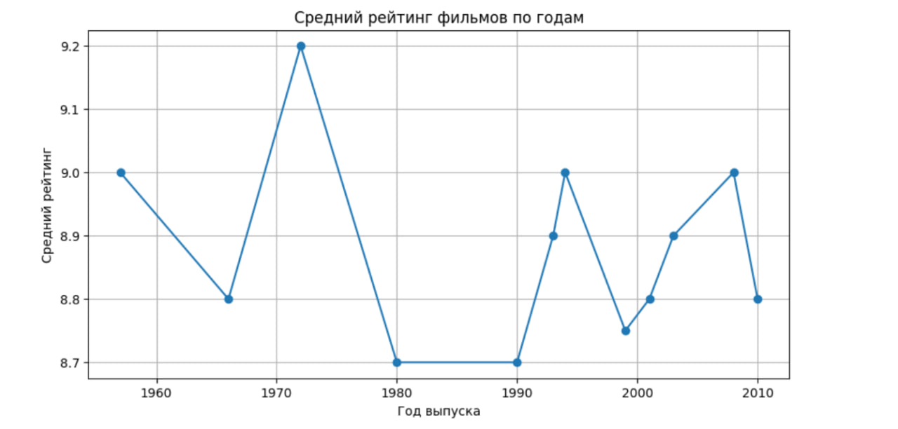

 Movie Analysis 

Небольшой проект по исследовательскому анализу данных (EDA) фильмов.

1. Описание проекта
- Загрузка данных о фильмах (название, год, рейтинг, количество голосов).
- Анализ структуры датасета.
- Поиск среднего рейтинга фильмов.
- Построение топ-10 фильмов по рейтингу.
- Визуализация рейтингов по годам.

2. Как запустить проект

1. Клонируйте репозиторий.
2. Установите зависимости: `pip install -r requirements.txt`
3. Запустите Jupyter Notebook: `jupyter notebook`
4. Откройте `notebooks/01_EDA.ipynb`

3.  Используемые библиотеки
- pandas
- matplotlib
- Jupyter Notebook
 

4. Визуализация результата

